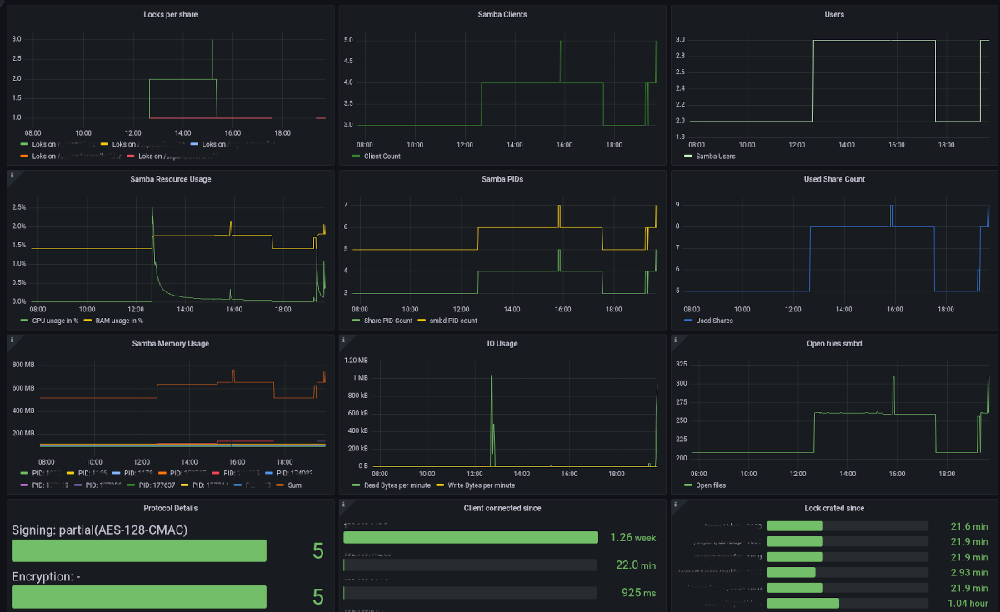

# Samba Exporter

A [prometheus exporter](https://prometheus.io/docs/instrumenting/exporters/) for statistic data of the [samba file server](https://www.samba.org/).

It uses [smbstatus](https://www.samba.org/samba/docs/current/man-html/smbstatus.1.html) and the [proc fs](https://en.wikipedia.org/wiki/Procfs) to collect the data and converts the result into prometheus style data.
The prometheus style data can be requested manually on port 9922 using a http client. Or a prometheus database sever can be configured to collect the data by scraping port 9922 on the samba server.

## Documentation

For detailed documentation please take a look at the [projects page](https://imker25.github.io/samba_exporter/Index/) or read in the [docs](./docs/Index.md) folder.

There are **RPM** and **DEB** packages for several Linux distributions for you ready to install. You may want to take a look at the [Supported Distributions and Versions](./docs/Installation/SupportedVersions.md) and the [Installation Guide](./docs/Installation/InstallationGuide.md)

