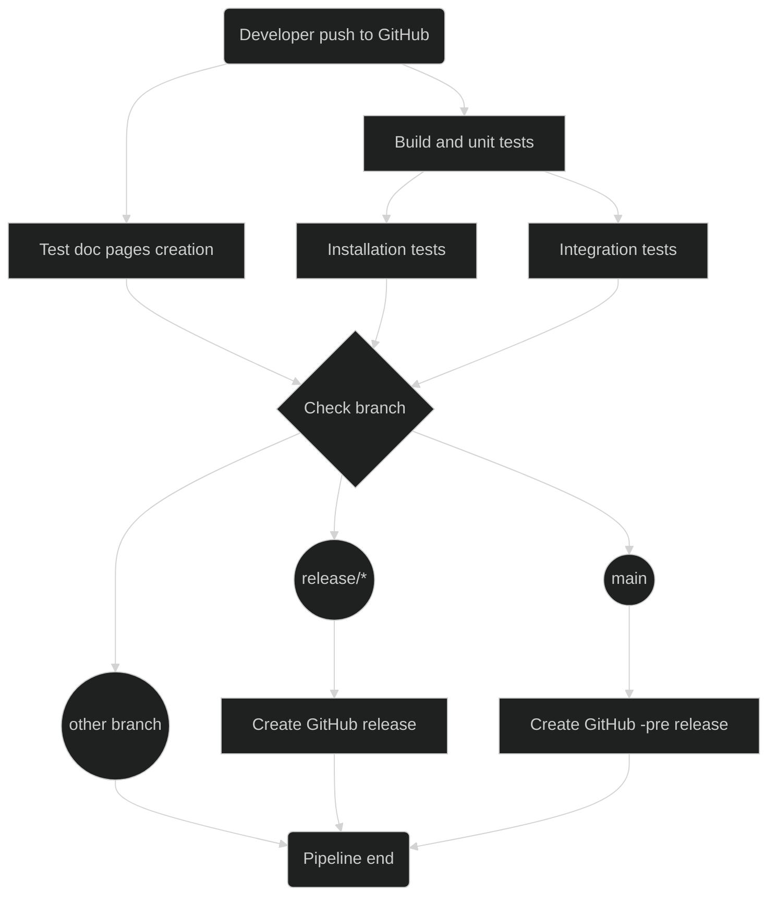
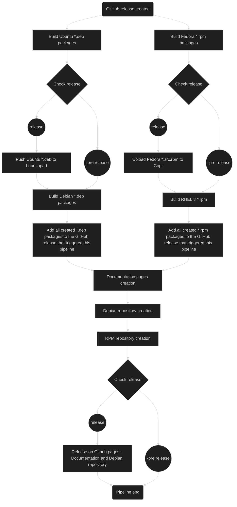

# GitHub Actions and Release Process

This page give information on the GitHub Actions and Release Process used by the project.

## CI/CD Pipeline

For continuous integration and deployment this project uses [GitHub Actions](https://github.com/imker25/samba_exporter/actions). The main pipeline is defined in `.github/workflows/ci-jobs.yml`. This pipeline will will start on every commit pushed to GitHub and then run the steps shown below:

## Release Pipeline

After a GitHub release (also -pre) is created by the the CI/CD pipeline the `.github/workflows/release-jobs.yml` will be triggered. This job does the following workflow:

### Launchpad release

Whenever a *.deb package is uploaded to the [samba-exporter PPA](https://launchpad.net/~imker/+archive/ubuntu/samba-exporter-ppa) launchpad will start a own release process. When this process is finished (usually takes about an hour), users can download and install the new package version from the PPA.

This uploads are done by the Release Pipeline for each **full Release** (no `-pre` Tag), as shown by the workflow diagram.

### Copr release

Whenever a *.src.rpm package is uploaded to the [samba-exporter COPR](https://copr.fedorainfracloud.org/coprs/imker25/samba-exporter/) copr will start a own release process. When this process is finished (usually takes about 10 minutes), users can download and install the new package version from the copr reposioty.

This uploads are done by the Release Pipeline for each **full Release**  (no `-pre` Tag), as shown by the workflow diagram.

## Creation of release branches

The release process of this project is fully automated. To create a new release (not -pre) of the software use the script `build/PrepareRelease.sh`. Before running the script ensure you are on `main` branch and got the latest changes from GitHub origin. This script will:

- Create a **release** branch from the current state at the main branch
- Update the `VersionMaster.txt` with a new increment version on **main** branch
- Commit the changes on the main branch
- Push all changes on **main** and the **new release** branch to GitHub

Once this changes are pushed to github the CI/CD pipeline will start to run for both, `main` and the new `release` branch. This will create a new **-pre Release** from `main` as well as a new **full Release**  from the new `release` branch.

As shown by the CI/CD Pipeline workflow `-pre` releases will be created for every commit pushed to the `main` branch on GitHub.
