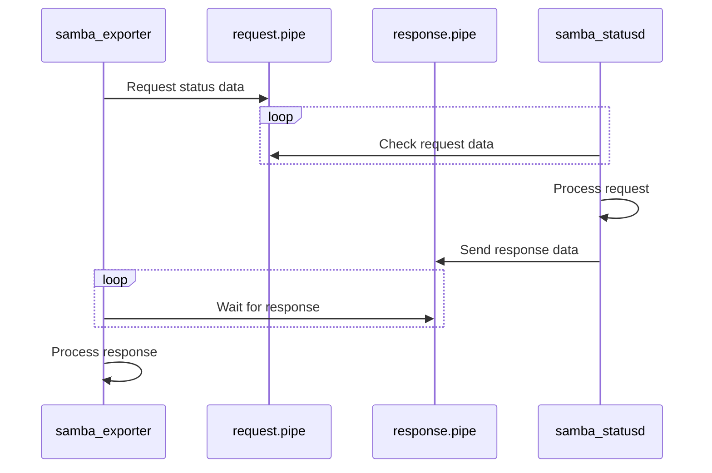

# Concept

Since the tool [smbstatus](https://www.samba.org/samba/docs/current/man-html/smbstatus.1.html) provided by the [samba](https://www.samba.org/) project can only run with elevated rights, and a [prometheus exporter](https://prometheus.io/docs/instrumenting/writing_exporters/) always exposes a public network endpoint, the samba_exporter package contains two services.

- **samba_exporter**: The prometheus exporter service that exposes the public network endpoint for the prometheus server to collect the data running as non **privileged user**
- **samba_statusd**: The service uses `smbstatus` to collect data and return it when requested running as **privileged user**

Both services can communicate using a named pipe owned by a common group, see diagram below.

