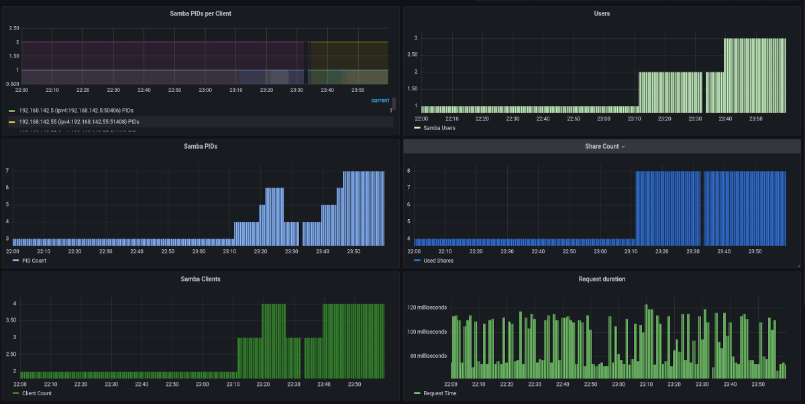
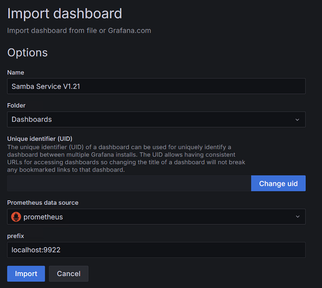

# Grafana Stack Integration

Here you can find how to integrate the `samba-exporter` service with the prometheus monitoring stack.

## Prometheus

To add this exporter to your [prometheus database](https://prometheus.io/) you have to add the endpoint as scrape job to the `/etc/prometheus/prometheus.yml` on your prometheus server. Therefor add the lines shown below:

```yaml
  - job_name: 'Samba exporter node on server.local'
    metrics_path: metrics
    static_configs:
      - targets: ['server.local:9922']
```

Replace `server.local` with the network name of your samba server.

## Grafana

For [grafana](https://grafana.com) an example dashboard is installed with the debian package and can be found at `/usr/share/doc/samba-exporter/grafana/SambaService.json`

Here is a screenshot of the example dashboard on a live system:



When [importing](https://grafana.com/docs/grafana/latest/dashboards/export-import/#import-dashboard) this dashboard you need to change `server.local` to the network name of your samba server.

Here is a screenshot to import dashboard with this example json file `SambaService.json`, and you need to replace the `prefix` name `server.local` with the network name of your samba server, like `localhost:9922`.


